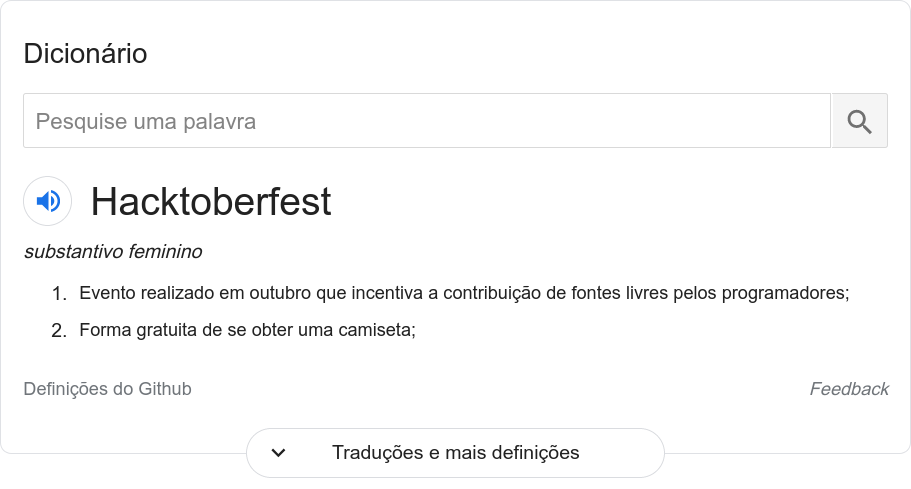
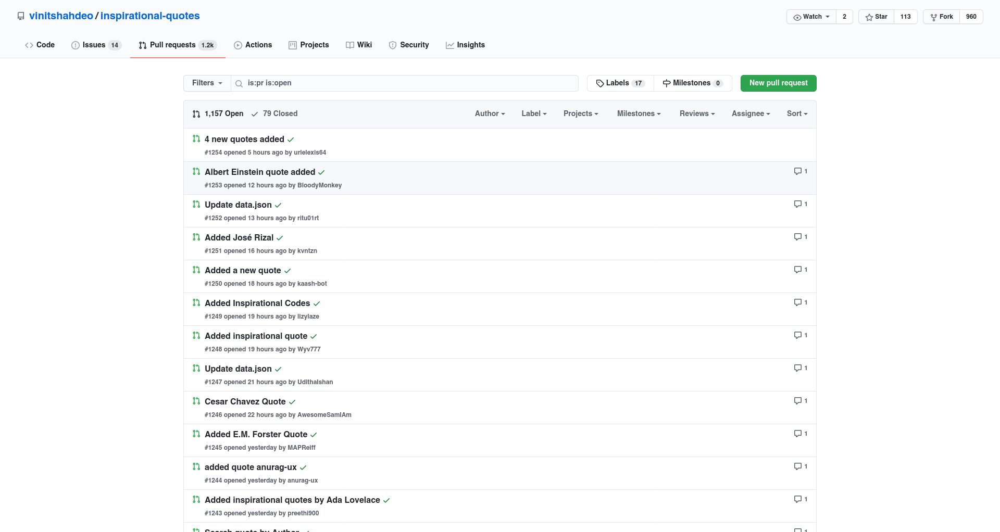
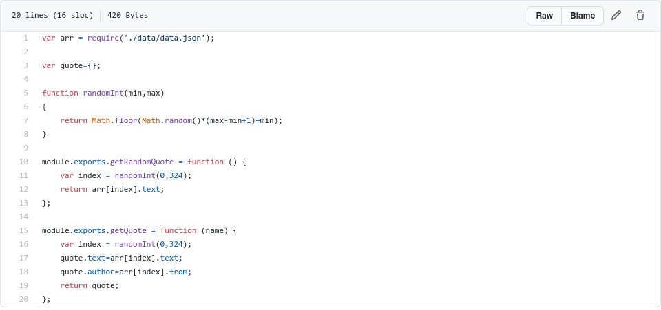
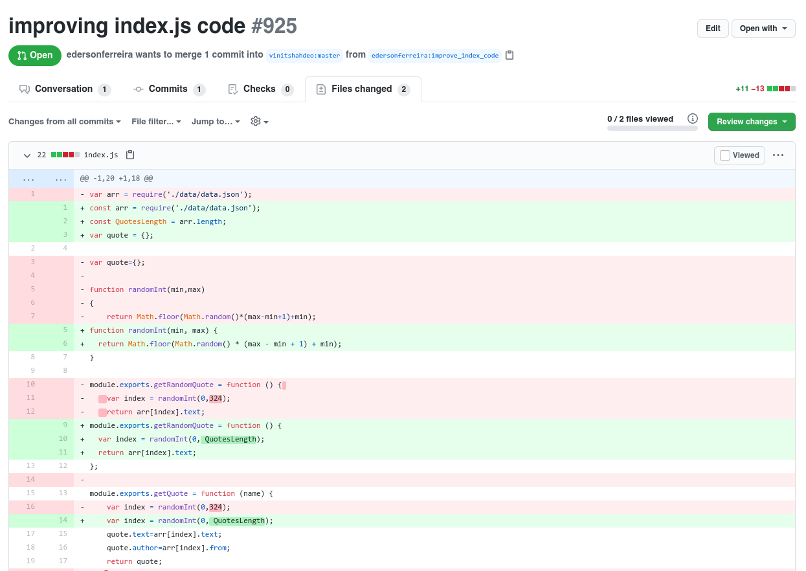
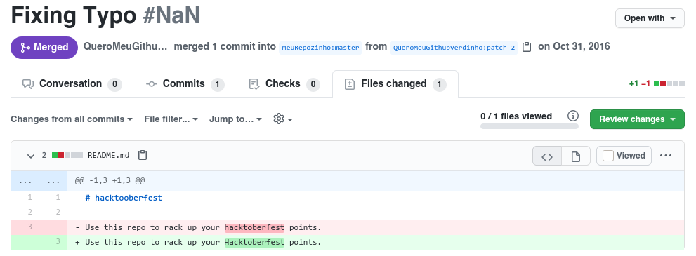
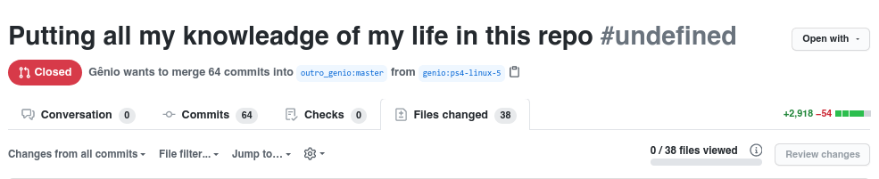

# Hacktoberfest

# Lembrando

Tudo que for escrito aqui, é pura piada, logo, não seja burro e não leve nada á sério.

# Definição

# Ideal

> "O ideal é que todas as pessoas criem reais contribuições á comunidade, ajudando sempre ao repositório ter mais código e ser mais útil á sociedade, assim, criando um mundo melhor, mais justo e meritocrático com as pessoas que causam reais impactos positivos."

# Realidade

# E o código fonte?

# Alguém mudou?

## Sim

# Foi mergeado?

## Não

# Mas, quais são os lados positivos?

- Ajudar a comunidade
- Deixar seu github verdinho
- Ganhar camiseta de grátis

# E quem é ajudado pela Hacktoberfest?

- Todas as pessoas do planeta menos os mainteiners.

# Como posso ajudar?

## Depende, você quer ajudar as florestas do seu github ou os mainteiners?

# Quero ajudar os mainteiners!

## Então não faça nada.

# E o github verdinho?

## Simples, faça isso:

# Mas, o que devemos fazer então?

Devemos fazer commits com real importância, como este abaixo:

# Considerações finais

Sim, eu ~~copiei~~ me inspirei no pokemao

